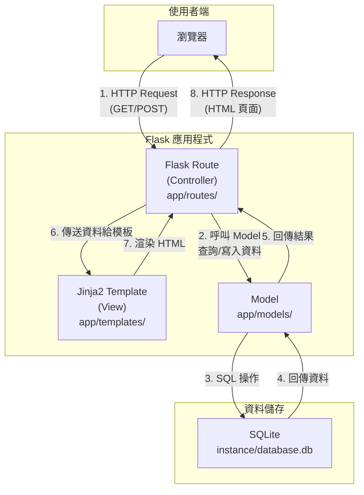
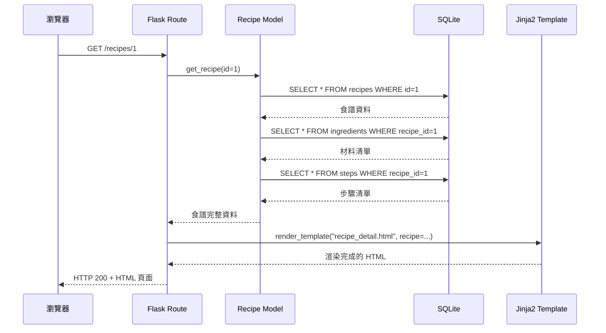

# 系統架構設計 — 食譜收藏系統

## 1. 技術架構說明

### 選用技術與原因

| 技術 | 角色 | 選用原因 |
|:---|:---|:---|
| **Python + Flask** | 後端 Web 框架 | 輕量、易學，適合中小型 Web 應用。內建開發伺服器，不需要複雜的設定即可上手。 |
| **Jinja2** | HTML 模板引擎 | Flask 內建的模板引擎，語法簡潔，支援模板繼承與變數渲染，讓 HTML 頁面能動態顯示資料。 |
| **SQLite** | 關聯式資料庫 | 不需要額外安裝資料庫伺服器，資料存成單一檔案，適合個人使用的輕量級應用。 |
| **HTML / CSS / JavaScript** | 前端頁面 | 標準 Web 技術，由 Jinja2 模板產生 HTML，搭配 CSS 美化介面。 |

### Flask MVC 模式說明

本專案採用 **MVC（Model-View-Controller）** 架構模式，各層職責如下：

```
┌─────────────────────────────────────────────────────┐
│                    使用者（瀏覽器）                     │
└─────────────┬───────────────────────┬───────────────┘
              │ HTTP Request          │ HTTP Response (HTML)
              ▼                       ▲
┌─────────────────────────────────────────────────────┐
│  Controller（Flask Routes）                          │
│  檔案位置：app/routes/                                │
│  職責：接收請求 → 呼叫 Model → 傳資料給 View          │
└──────┬──────────────────────────────┬───────────────┘
       │                              │
       ▼                              ▼
┌──────────────────┐    ┌──────────────────────────────┐
│  Model            │    │  View（Jinja2 Templates）     │
│  檔案：app/models/ │    │  檔案：app/templates/         │
│  職責：定義資料結構 │    │  職責：定義 HTML 頁面結構，    │
│  與資料庫操作       │    │  接收資料並渲染成最終 HTML     │
└──────┬───────────┘    └──────────────────────────────┘
       │
       ▼
┌──────────────────┐
│  SQLite 資料庫    │
│  檔案：instance/  │
│  database.db      │
└──────────────────┘
```

- **Model（模型）**：定義資料表結構（如食譜、材料、步驟），負責與 SQLite 資料庫溝通，處理資料的新增、查詢、修改、刪除。
- **View（視圖）**：Jinja2 HTML 模板，負責決定頁面長什麼樣子。接收 Controller 傳來的資料，渲染成使用者看到的 HTML 頁面。
- **Controller（控制器）**：Flask 路由函式，負責接收使用者的 HTTP 請求，呼叫 Model 取得或修改資料，再將結果傳給 View 渲染。

---

## 2. 專案資料夾結構

```
web_app_development/
│
├── app.py                    ← 應用程式入口，啟動 Flask 伺服器
├── config.py                 ← 設定檔（資料庫路徑、密鑰等）
├── requirements.txt          ← Python 套件清單
│
├── app/                      ← 主要應用程式目錄
│   ├── __init__.py           ← Flask App 工廠函式（create_app）
│   │
│   ├── models/               ← Model 層：資料庫模型
│   │   ├── __init__.py
│   │   └── recipe.py         ← 食譜、材料、步驟的資料模型
│   │
│   ├── routes/               ← Controller 層：路由處理
│   │   ├── __init__.py
│   │   └── recipe.py         ← 食譜相關的路由（CRUD）
│   │
│   ├── templates/            ← View 層：Jinja2 HTML 模板
│   │   ├── base.html         ← 基礎模板（共用的 header/footer）
│   │   ├── index.html        ← 首頁 / 食譜列表頁
│   │   ├── recipe_detail.html ← 食譜詳細頁（材料與步驟）
│   │   ├── recipe_form.html  ← 新增 / 編輯食譜的表單頁
│   │   └── confirm_delete.html ← 刪除確認頁
│   │
│   └── static/               ← 靜態資源
│       ├── css/
│       │   └── style.css     ← 自訂樣式表
│       └── js/
│           └── main.js       ← 前端 JavaScript（如有需要）
│
├── database/                 ← 資料庫相關
│   └── schema.sql            ← SQL 建表語句
│
├── instance/                 ← Flask instance 目錄（自動產生）
│   └── database.db           ← SQLite 資料庫檔案
│
└── docs/                     ← 設計文件
    ├── PRD.md                ← 產品需求文件
    ├── ARCHITECTURE.md       ← 系統架構文件（本文件）
    ├── FLOWCHART.md          ← 流程圖（待產出）
    ├── DB_DESIGN.md          ← 資料庫設計（待產出）
    └── ROUTES.md             ← 路由設計（待產出）
```

### 各目錄用途說明

| 目錄/檔案 | 用途 |
|:---|:---|
| `app.py` | 程式入口點，執行 `python app.py` 啟動開發伺服器 |
| `config.py` | 集中管理設定（如資料庫路徑、SECRET_KEY），避免寫死在程式碼中 |
| `app/__init__.py` | 使用 Flask「應用程式工廠模式」，建立並設定 Flask app 實例 |
| `app/models/` | 放置資料模型，每個模型檔案對應一組相關的資料表操作 |
| `app/routes/` | 放置路由（Controller），每個檔案負責一組功能的 URL 處理 |
| `app/templates/` | 放置 Jinja2 HTML 模板，`base.html` 定義共用版面供其他頁面繼承 |
| `app/static/` | 放置 CSS、JavaScript、圖片等靜態檔案 |
| `database/` | 放置 SQL schema 檔案，方便初始化或重建資料庫 |
| `instance/` | Flask instance 目錄，存放 SQLite 資料庫檔案（不應加入版本控制） |

---

## 3. 元件關係圖

以下使用 Mermaid 語法描述系統元件之間的互動關係：



### 請求處理流程（以「檢視食譜」為例）



---

## 4. 關鍵設計決策

### 決策 1：使用 Flask 應用程式工廠模式（Application Factory）

- **選擇**：在 `app/__init__.py` 中使用 `create_app()` 工廠函式建立 Flask 實例。
- **原因**：將 app 的建立與設定封裝在函式中，方便在不同環境（開發 / 測試）使用不同設定，也避免循環引用的問題。

### 決策 2：使用原生 sqlite3 而非 ORM

- **選擇**：使用 Python 內建的 `sqlite3` 模組直接操作資料庫，而非 SQLAlchemy 等 ORM。
- **原因**：專案規模小、資料表簡單，直接寫 SQL 語句更直觀易懂，也讓初學者更容易理解資料庫操作的本質。

### 決策 3：使用 Jinja2 模板繼承

- **選擇**：建立 `base.html` 基礎模板，其他頁面模板透過 `` 繼承共用的 HTML 結構。
- **原因**：避免在每個頁面重複撰寫 `<head>`、`<nav>`、`<footer>` 等共用元素，修改一處即可全站生效，維護更方便。

### 決策 4：按功能模組組織路由

- **選擇**：使用 Flask Blueprint，將食譜相關的路由放在 `app/routes/recipe.py`。
- **原因**：當功能增加時，可以輕鬆新增模組（如未來加入使用者認證），不會讓單一檔案過於龐大，保持程式碼的可讀性。

### 決策 5：將材料與步驟作為獨立資料表

- **選擇**：食譜、材料、步驟分別存放在不同的資料表，透過外鍵（`recipe_id`）關聯。
- **原因**：每個食譜可以有不同數量的材料和步驟，使用獨立資料表搭配一對多關聯，比將所有資料塞進同一張表更靈活、更好維護。
