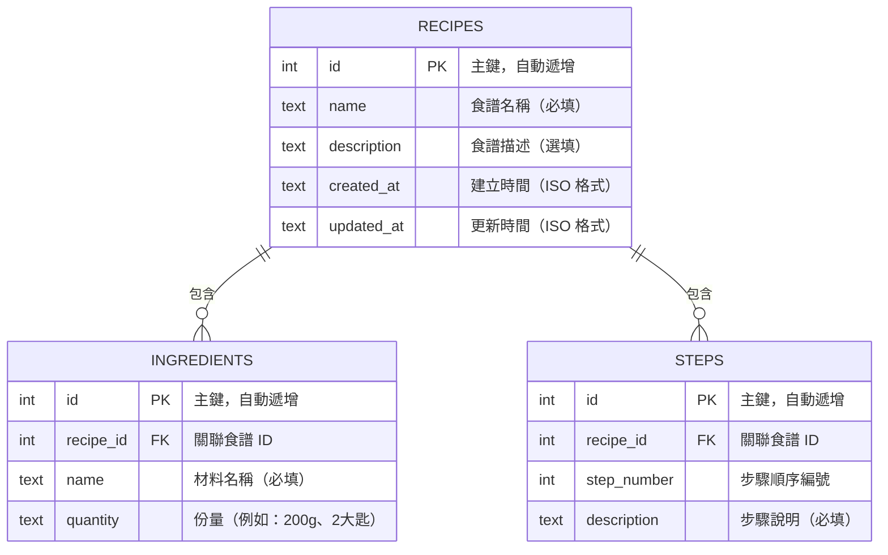

# 資料庫設計 — 食譜收藏系統

## 1. ER 圖（實體關係圖）

### 關聯說明

- **RECIPES ↔ INGREDIENTS**：一對多關聯。一個食譜可以有多個材料，每個材料只屬於一個食譜。
- **RECIPES ↔ STEPS**：一對多關聯。一個食譜可以有多個步驟，每個步驟只屬於一個食譜。

---

## 2. 資料表詳細說明

### 2.1 RECIPES（食譜）

主要資料表，儲存每個食譜的基本資訊。

| 欄位 | 型別 | 必填 | 說明 |
|:---|:---|:---|:---|
| `id` | INTEGER | 自動 | 主鍵，自動遞增（PRIMARY KEY AUTOINCREMENT） |
| `name` | TEXT | ✅ 是 | 食譜名稱，例如「番茄炒蛋」 |
| `description` | TEXT | ❌ 否 | 食譜描述，簡短說明這道料理的特色 |
| `created_at` | TEXT | 自動 | 建立時間，存 ISO 8601 格式（如 `2026-04-28T12:00:00`） |
| `updated_at` | TEXT | 自動 | 最後更新時間，每次修改時自動更新 |

- **Primary Key**：`id`
- **索引**：無額外索引（資料量小，暫不需要）

### 2.2 INGREDIENTS（材料）

儲存每個食譜所需的材料清單。

| 欄位 | 型別 | 必填 | 說明 |
|:---|:---|:---|:---|
| `id` | INTEGER | 自動 | 主鍵，自動遞增 |
| `recipe_id` | INTEGER | ✅ 是 | 外鍵，關聯到 RECIPES 表的 `id` |
| `name` | TEXT | ✅ 是 | 材料名稱，例如「雞蛋」、「番茄」 |
| `quantity` | TEXT | ❌ 否 | 份量說明，例如「3顆」、「200g」、「適量」 |

- **Primary Key**：`id`
- **Foreign Key**：`recipe_id` → `RECIPES(id)`，設定 `ON DELETE CASCADE`（刪除食譜時自動刪除相關材料）

### 2.3 STEPS（步驟）

儲存每個食譜的料理步驟，按照順序排列。

| 欄位 | 型別 | 必填 | 說明 |
|:---|:---|:---|:---|
| `id` | INTEGER | 自動 | 主鍵，自動遞增 |
| `recipe_id` | INTEGER | ✅ 是 | 外鍵，關聯到 RECIPES 表的 `id` |
| `step_number` | INTEGER | ✅ 是 | 步驟順序編號（從 1 開始） |
| `description` | TEXT | ✅ 是 | 步驟說明，例如「將雞蛋打散加入少許鹽」 |

- **Primary Key**：`id`
- **Foreign Key**：`recipe_id` → `RECIPES(id)`，設定 `ON DELETE CASCADE`（刪除食譜時自動刪除相關步驟）

---

## 3. 設計決策說明

| 決策 | 原因 |
|:---|:---|
| 時間欄位用 `TEXT` 存 ISO 格式 | SQLite 沒有原生 DATETIME 型別，用 TEXT 存 ISO 8601 字串是官方推薦做法 |
| 材料與步驟獨立成表 | 每個食譜的材料和步驟數量不固定，用一對多關聯比 JSON 字串更靈活、更好查詢 |
| 使用 `ON DELETE CASCADE` | 刪除食譜時自動清除相關的材料和步驟，避免殘留孤兒資料 |
| `quantity` 用 TEXT 而非數字 | 份量格式多樣（如「2大匙」、「適量」、「200g」），用文字最靈活 |
| `step_number` 用整數 | 方便排序和重新編號，確保步驟按正確順序顯示 |
