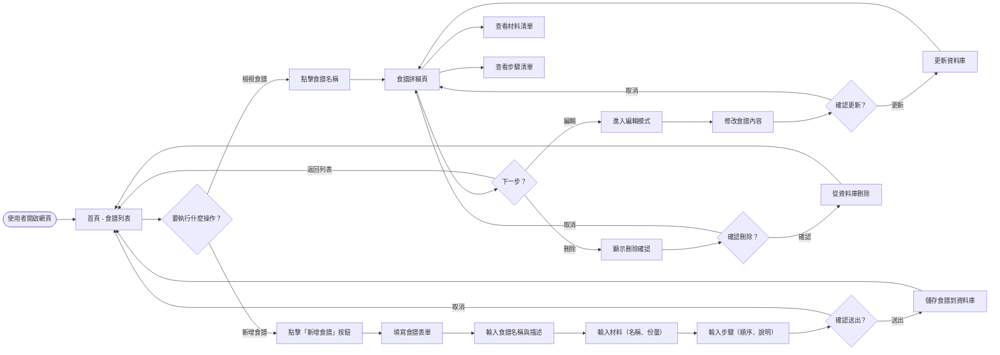
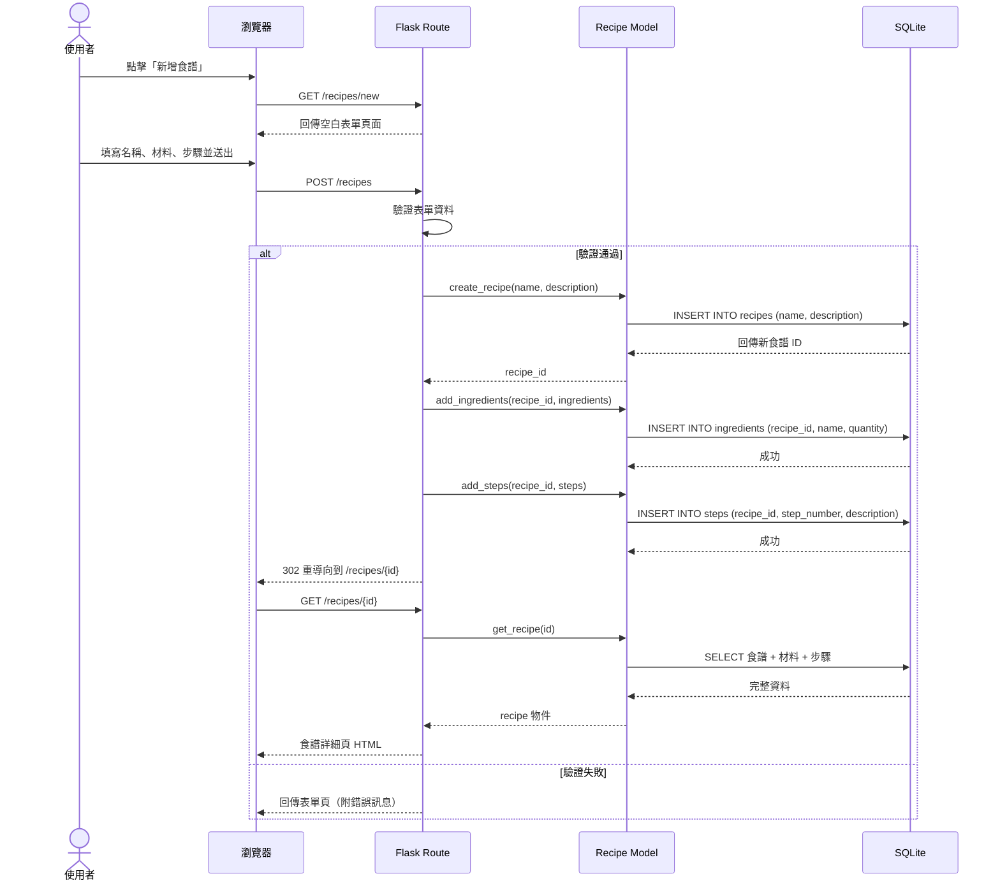
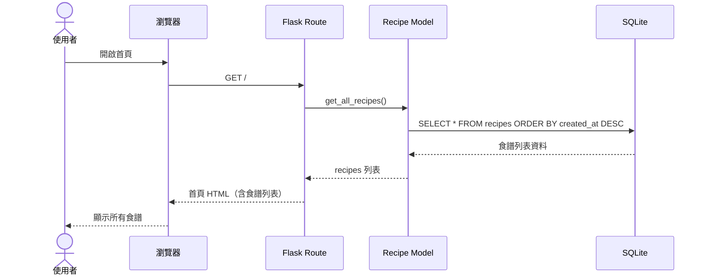
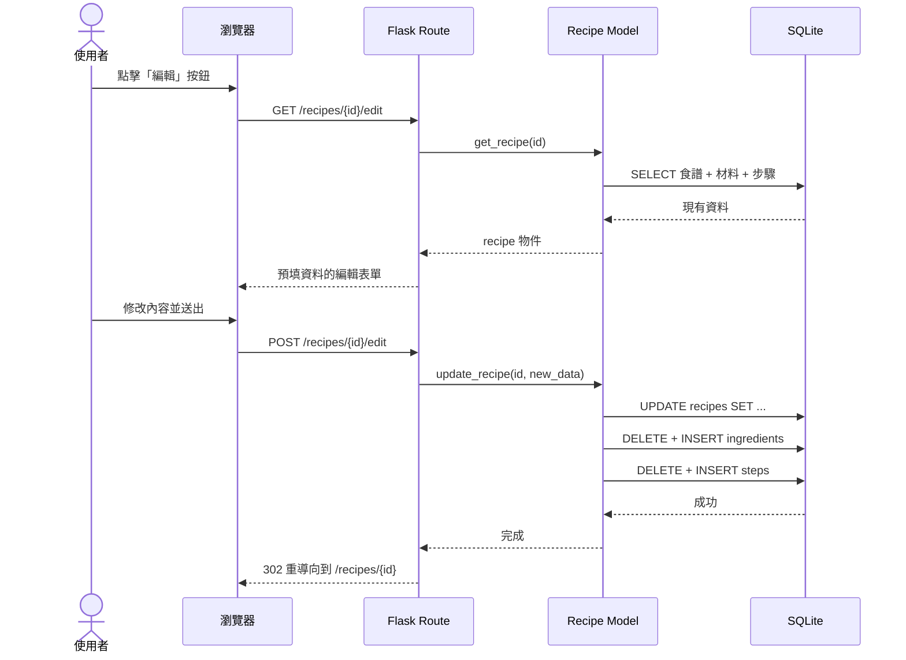
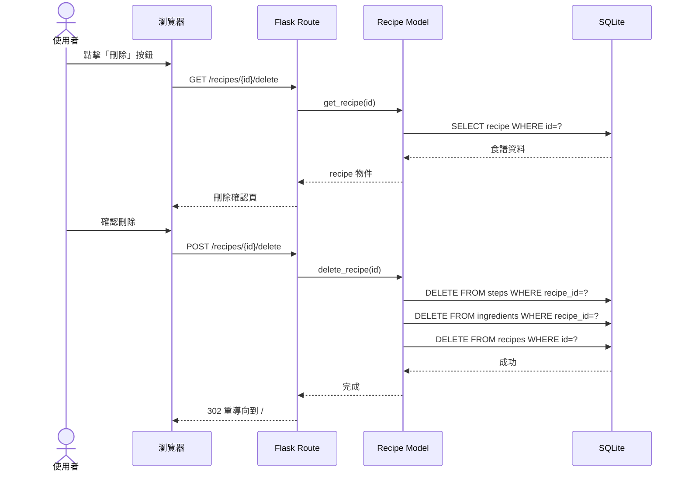

# 流程圖設計 — 食譜收藏系統

## 1. 使用者流程圖（User Flow）

以下流程圖描述使用者從進入網站到完成各項操作的完整路徑：

### 流程說明

- **起點**：使用者開啟網頁，進入首頁看到所有食譜列表
- **四條主要路徑**：
  1. **新增** → 填寫表單 → 儲存 → 回到列表
  2. **檢視** → 點擊食譜 → 查看材料與步驟
  3. **編輯** → 從詳細頁進入 → 修改內容 → 更新 → 回到詳細頁
  4. **刪除** → 從詳細頁進入 → 確認刪除 → 回到列表
- **安全機制**：刪除前會顯示確認頁面，避免誤刪

---

## 2. 系統序列圖（Sequence Diagram）

### 2.1 新增食譜

描述使用者新增一筆食譜時，從瀏覽器到資料庫的完整資料流：

### 2.2 瀏覽食譜列表

### 2.3 編輯食譜

### 2.4 刪除食譜

---

## 3. 功能清單對照表

| 功能 | URL 路徑 | HTTP 方法 | 說明 |
|:---|:---|:---|:---|
| 瀏覽食譜列表 | `/` | GET | 首頁，顯示所有食譜（依建立時間倒序） |
| 新增食譜表單 | `/recipes/new` | GET | 顯示空白的食譜新增表單 |
| 新增食譜送出 | `/recipes` | POST | 接收表單資料，建立新食譜、材料與步驟 |
| 檢視食譜詳情 | `/recipes/<id>` | GET | 顯示單一食譜的完整資訊（材料 + 步驟） |
| 編輯食譜表單 | `/recipes/<id>/edit` | GET | 顯示預填資料的編輯表單 |
| 編輯食譜送出 | `/recipes/<id>/edit` | POST | 接收修改後的資料，更新食譜 |
| 刪除確認頁 | `/recipes/<id>/delete` | GET | 顯示刪除確認頁面 |
| 刪除食譜送出 | `/recipes/<id>/delete` | POST | 確認刪除，移除食譜及其材料與步驟 |
